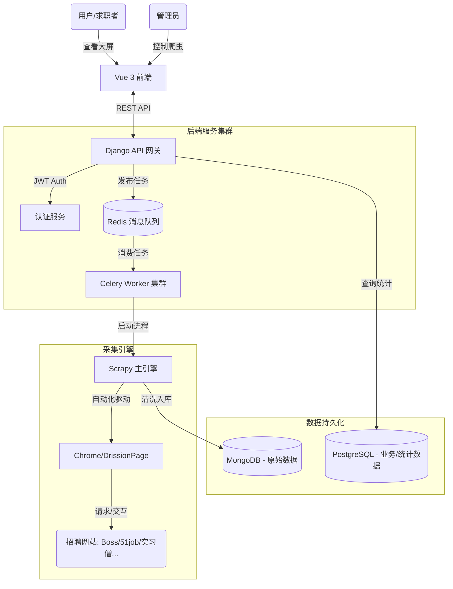

# 🕷️ JobRadar - 全网职位采集与分析平台

> **一个基于微服务架构的分布式职位数据采集与可视化分析中台**
>
> *From Course Project to Enterprise Solution*


---

##  项目背景与简介

**JobRadar** (原名 SpiderScope) 起源于一次大学课程设计，经过不断的重构与迭代，现已演变为一个具备**企业级架构雏形**的全栈采集系统。

项目旨在解决传统招聘数据采集中的痛点：平台反爬严格、数据分散杂乱、无法集中分析。通过构建自动化的数据流水线，我们实现了对 **Boss直聘**、**前程无忧 (51job)**、**实习僧**、**应届生求职网** 等主流平台的职位数据采集、清洗与结构化入库。

> ⚠️ **说明**：作者是一名前端"苦手"的后端开发者，本项目**重在后端架构、爬虫攻防与数据处理**。前端界面使用了 Element Plus 进行快速搭建，虽然UI较为朴素（丑），但功能逻辑绝对硬核完整！

---

## ✨ 核心亮点

- **🛡️ 硬核抗反爬引擎**
  - **Selenium 隐身模式**：自研中间件集成 CDP 协议，完美隐藏 WebDriver 特征，成功绕过 51job 等站点的检测。
  - **DrissionPage 集成**：引入新一代自动化工具 DrissionPage，专门攻克 Boss直聘 等高难度风控站点。
  - **动态采集**：支持在前端动态输入关键词与城市，告别"硬编码"爬虫，想爬什么由你决定。

- **⚙️ 分布式后端架构**
  - **Django + DRF**：构建稳健的 RESTful API 与任务调度中心。
  - **Celery + Redis**：实现高并发异步任务队列，支持多 Worker 分布式部署。
  - **混合存储**：PostgreSQL 存储业务数据，MongoDB 存储海量职位详情，各取所长。

- **🔐 完备的权限体系**
  - 基于 **JWT** 的无状态认证。
  - 实现了用户与管理员的权限隔离：普通用户看数据，管理员控爬虫。

---

## 🏗 系统架构图



---

## 🐳 Docker 一键部署指南 (推荐)

本项目已全面支持容器化，这是最省心的安装方式。

### 1. 前置准备
确保您的服务器或本机已安装：
- [Docker](https://www.docker.com/)
- [Docker Compose](https://docs.docker.com/compose/)

### 2. 配置文件
在项目根目录创建 `.env` 文件 (可选，用于自定义配置)：
```env
DB_NAME=spiderscope
DB_USER=postgres
DB_PASSWORD=your_password
REDIS_URL=redis://redis:6379/0
```

### 3. 一键启动
```bash
# 编译并启动所有服务 (后端、数据库、Redis、Celery)
# 注意：前端目前建议本地运行或单独构建 Nginx 镜像
docker-compose up -d --build
```

### 4. 初始化数据
容器启动后，需要进行数据库迁移和创建管理员：
```bash
# 进入后端容器
docker-compose exec backend bash

# 执行迁移
python manage.py migrate

# 创建超级管理员
python manage.py createsuperuser
```

访问 `http://localhost:8000` 即可看到后端服务已就绪。

---

## 🛠 本地开发部署 (传统方式)

如果您想进行代码修改或调试，建议使用本地环境。

### 后端 (Backend)

1.  **环境安装**
    ```bash
    cd backend
    python -m venv .venv
    source .venv/bin/activate  # Windows: .venv\Scripts\activate
    pip install -r ../requirements.txt
    ```

2.  **启动服务**
    需要开启两个终端窗口：
    ```bash
    # 终端 1: API 服务
    python manage.py runserver
    
    # 终端 2: 任务队列 (Windows 需加 -P eventlet)
    celery -A spiderscope worker -l info -P eventlet
    ```

### 前端 (Frontend)

```bash
cd frontend
npm install
npm run dev
```

---

## 💡 使用手册

1.  **数据大屏**：
    打开首页，系统会自动聚合数据库中的职位信息，展示薪资分布图表。无需登录即可查看。
2.  **登录后台**：
    点击右上角 **"登录 / 管理"**，使用管理员账号登录。
3.  **爬虫控制台**：
    登录后进入控制台，选择 **"Boss直聘"** 或 **"前程无忧"**，输入关键词（如 `Python`），点击启动。
    *注意：本地运行时会弹出浏览器窗口，请勿手动关闭，静待脚本执行完毕。*

---

## � 关于作者

**YYP21052**
- 一个热衷于后端架构与爬虫对抗的开发者。
- 项目源于课程设计，但在不断优化中付出了大量心血。
- 如果如果您觉得不错，欢迎点个 ⭐ **Star** 支持一下！

---

## 📄 开源协议

MIT License
