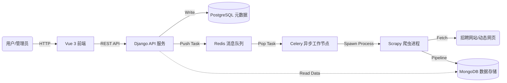

# 🕷️ JobRadar (Powered by SpiderScope)

> **一个基于微服务架构的分布式职位数据采集与分析中台**
> A distributed web scraping and data analysis platform built with Django, Vue 3, Scrapy, and Celery.


---

## 📖 项目简介 (Introduction)

**JobRadar** 是一个前后端分离的分布式爬虫管理系统。项目旨在解决招聘网站高反爬、动态渲染的采集难题，通过自动化的数据流水线，为求职者提供职位数据的采集、清洗与可视化分析服务。

本项目从底层的 **SpiderScope** 采集引擎演进而来，目前正处于 **v2.0** 迭代阶段，重点构建基于 JWT 的权限体系与基于 Selenium 的动态采集能力。

---

## 🏗️ 系统架构 (Architecture)

本项目采用**微服务思想**设计，各组件通过 Docker 容器化编排，实现了业务逻辑、数据采集与任务调度的解耦。



---

## 🛠️ 技术栈 (Tech Stack)

### 💻 后端与基础设施 (Backend & Infra)

| 组件 | 技术选型 | 作用描述 |
| --- | --- | --- |
| **Web 框架** | Django + DRF | 提供 RESTful API，处理业务逻辑与鉴权 |
| **爬虫框架** | Scrapy | 高并发异步数据抓取 |
| **异步调度** | Celery + Redis | 生产者-消费者模型，实现任务异步分发 |
| **浏览器自动化** | Selenium / Playwright | **(v2.0)** 处理 JS 动态渲染与模拟登录 |
| **数据库** | PostgreSQL | 存储用户、任务配置等结构化数据 |
| **数据库** | MongoDB | 存储职位详情、标签等非结构化数据 |
| **容器化** | Docker Compose | 一键编排所有服务，环境代码化 (IaC) |

### 🖥️ 前端交互 (Frontend)

* **核心框架**: Vue 3 (Composition API)
* **构建工具**: Vite (毫秒级热更新)
* **UI 组件库**: Element Plus
* **网络请求**: Axios (配合拦截器处理 JWT)
* **数据可视化**: ECharts **(v2.0)**

---

## 🚀 功能特性 (Features)

### ✅ 已完成 (v1.0 - SpiderScope Engine)

* [x] **基础设施容器化**：Docker Compose 统一管理 PG, Mongo, Redis。
* [x] **RESTful API 设计**：遵循规范的资源导向接口设计。
* [x] **Polyglot Persistence**：关系型与非关系型数据库的混合存储实践。
* [x] **分布式任务调度**：基于 Celery 实现“创建即触发”的自动化闭环。
* [x] **进程隔离**：解决 Windows 下 `subprocess` 调用爬虫的死锁问题。
* [x] **可视化控制台**：基于 Vue 3 的任务管理、状态监控与数据回显。
* [x] **CORS 跨域处理**：完善的前后端分离通信机制。

### 🚧 开发中 (v2.0 - JobRadar Evolution)

* [ ] **RBAC 权限体系**：
* 集成 **JWT (JSON Web Token)** 实现无状态登录。
* 用户端（求职者）与管理端（运维）的路由权限隔离。


* [ ] **高级采集引擎**：
* 集成 **Selenium** 中间件，对抗动态 JS 渲染与反爬虫。
* 建立 User-Agent 池与代理 IP 轮换机制。


* [ ] **职位数据中台**：
* 职位数据的清洗与结构化（薪资范围提取、技能分词）。
* 薪资分布与技能热力的可视化图表展示。


---

## ⚡ 快速开始 (Quick Start)

### 1. 克隆项目

```bash
git clone git@github.com:YYP21052/SpiderScope.git
cd JobRadar

```

### 2. 启动后端与基础设施

确保已安装 Docker Desktop。

```bash
# 启动所有容器 (PG, Mongo, Redis)
docker-compose up -d

# 进入后端虚拟环境并运行
cd backend
python manage.py runserver
# 另开终端运行 Celery
celery -A spiderscope worker -l info -P eventlet

```

### 3. 启动前端

```bash
cd frontend
npm install
npm run dev

```

访问 `http://localhost:5173` 即可看到管理后台。

---

## 📂 目录结构 (Directory Structure)

```text
JobRadar/
├── backend/                # Django 后端工程
│   ├── core/               # 核心业务逻辑 (Model, View, Task)
│   ├── crawler/            # Scrapy 爬虫工程
│   ├── spiderscope/        # Django 配置 (Settings, URL)
│   └── manage.py
├── frontend/               # Vue 3 前端工程
│   ├── src/                # 页面源码
│   └── vite.config.js
├── docker-compose.yml      # 容器编排文件
└── README.md               # 项目说明书

```

---

## 📝 作者 (Author)

**YYP21052**

* 致力于 Python Web 全栈开发与网络爬虫技术研究。
* 正在寻找 **Python 后端 / 爬虫工程师** 岗位。

---
